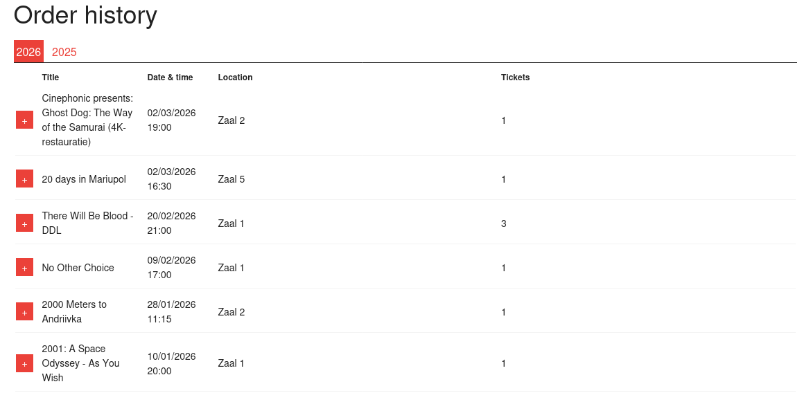
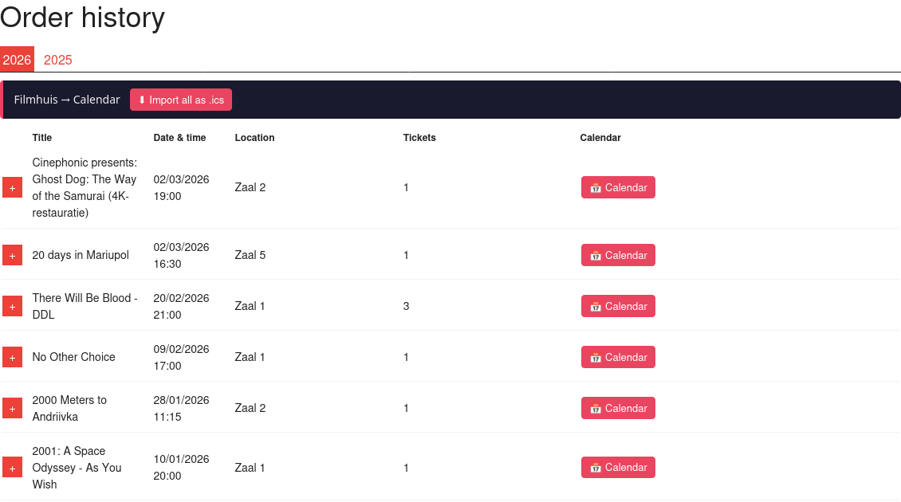

# Filmhuis Den Haag – Add to Calendar

A Firefox extension that adds `.ics` export buttons to your [Filmhuis Den Haag](https://filmhuisdenhaag.nl) order history, so you can import screenings directly into your calendar app.

## Features

- **Per-row button** — export a single screening as a `.ics` file
- **Import all** — export all visible screenings in one `.ics` file
- Activates only on `filmhuisdenhaag.nl` (any subdomain) when the page contains an order history table
- ICS output includes title, date/time, location, and zaal — DST-aware (Europe/Amsterdam)

## Screenshot




## Installation

Install from [Firefox Add-ons (AMO)](https://addons.mozilla.org).

### Manual install (Firefox Nightly / Developer Edition)

1. Download `filmhuis_calendar.xpi` from the [Releases](https://github.com/paNjii/filmhuis-ics-addon/releases) page
2. Open Firefox → `about:addons` → gear icon → **Install Add-on From File**
3. Select the `.xpi`

### Firefox for Android

1. Install [Firefox Nightly](https://play.google.com/store/apps/details?id=org.mozilla.fenix) from the Play Store
2. Go to Settings → About Firefox Nightly → tap the logo 5× to enable debug mode
3. Settings → Install extension from file → select the `.xpi`

## Usage

1. Go to your Filmhuis Den Haag order history and log in
2. Click a year tab (e.g. **2026**) to load your orders
3. A red **Filmhuis → Calendar** bar appears at the top of the table
4. Tap **📅 Calendar** on any row to download a single `.ics`, or **⬇ Import all** for everything
5. Open the `.ics` file with your calendar app (Google Calendar, Apple Calendar, etc.)

## Building from source

Requires `zip`.

```bash
git clone https://github.com/paNjii/filmhuis-ics-addon.git
cd filmhuis-ics-addon
bash package.sh
# outputs filmhuis_calendar.xpi
```

## Repository layout

```
filmhuis-ics-addon/
├── manifest.json
├── content.js
├── style.css
├── icons/
│   ├── icon-48.png
│   └── icon-96.png
├── package.sh
└── README.md
```

## License

MIT